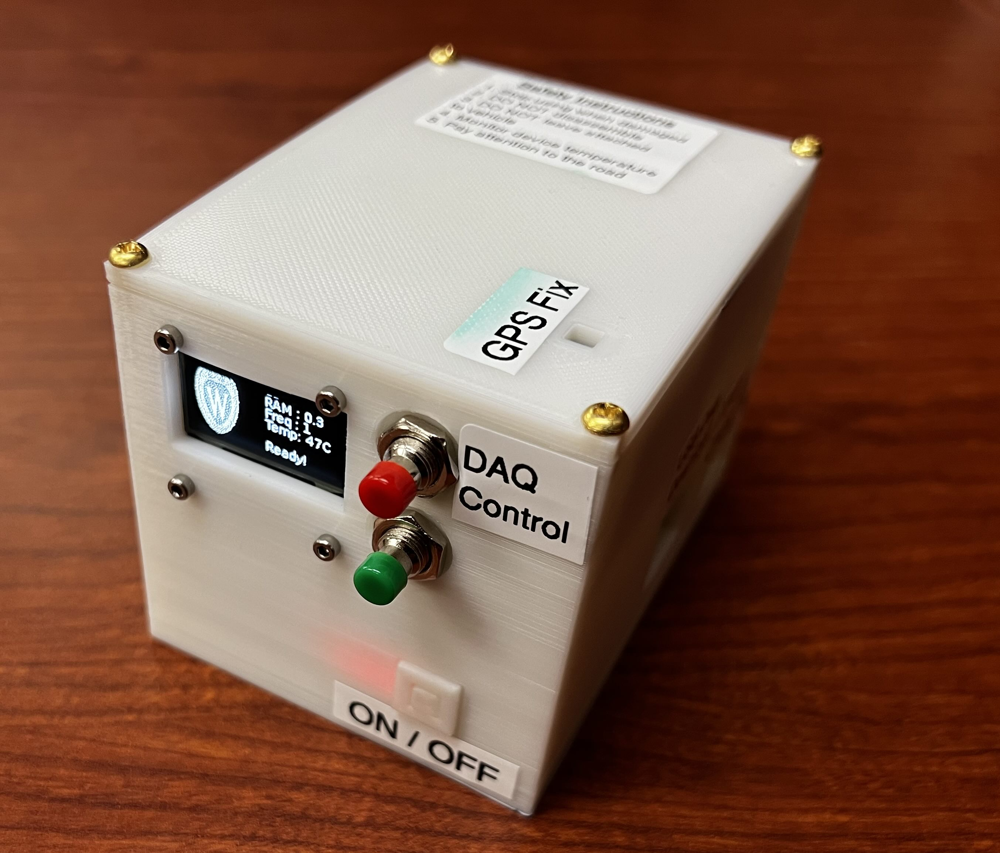

# GPS and IMU Data Acquisition System

- The repository contains the software for the DAQ system designed to continuous collect GPS and IMU data. 
- The software was developed as a part of the project DriveSense.
- The hardware is made of the following
  - Raspberry Pi Zero 2
  - BerryGPS-IMU V4
  - Geekworm X306 V1.3 18650 UPS
  - Push Button
  - OLED Mini Display
  - Battery

## Build

- The BOM can be found [here](resources/BillOfMaterials.xlsx)
- The operation manual can be found [here](resources/OperationManual.docx)





## Features

### General

Current capabilities of the software

- Data collection and download is push-button operated.
- OLED display to indicate status in real-time.
- Concurrency to enable uninterrupted DAQ at a high sampling rate.
- Remote DAQ firmware update.

### DAQ System Capabilities

Capabilities of the DAQ system

- GPS - 10S/s
- IMU - 800S/s to 3.3KS/s
  - Handled through INT2 Pin
  - SPI Read of FIFO Buffers in LSM6DSL
  - 3-axis acceleration and gyroscope

## Device Setup

Assuming that the hardware is built with all the necessary components

1. Flash the SD card of the pi with Bookworm 64-bit OS
2. Clone the repository
3. Navigate to the directory `device_setup/GPS-DAQ-Config` inside the repo

```shell
cd ./daq-gps-imu/device_setup/GPS-DAQ-Config
```

4. Run the shell script `command.sh`.

```shell
chmod +x ./command.sh && ./command.sh
```

5. Reboot the system

The shell script `command.sh` should take care of the following:

- Configure the i2c, SPI and UART for interface with the sensors and display
- Install necessary packages
- Compile the python application `pyinstaller`
- Set up all the necessary automation
  - Autostart of the application during boot
  - Easy update of the DAQ firmware
  - Auto configuration for USB device for data download

## Future Updates

- [ ] Energy optimization to improve battery life
- [ ] Utilizing DMA to improve the sampling rate for SPI and other ADC interfaces
- [ ] Adding more sensor packages to the system


